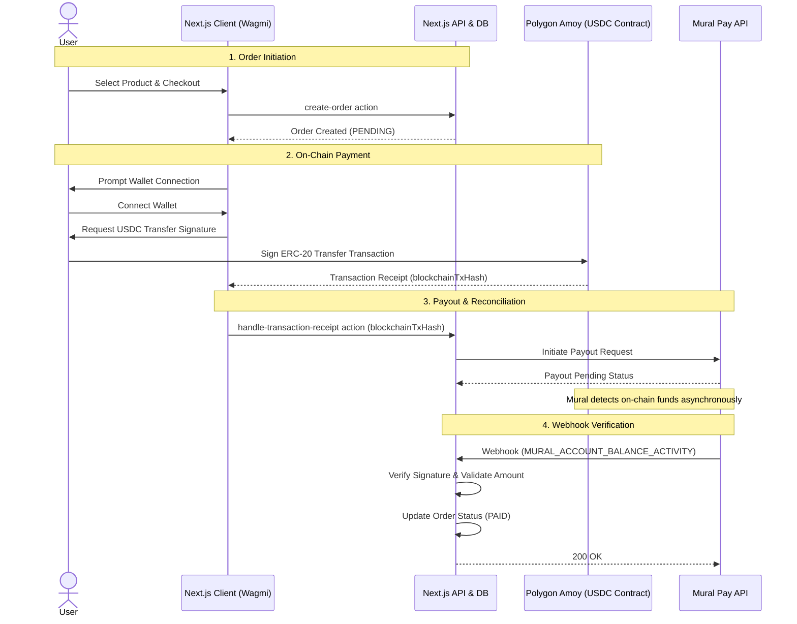

# Mural Pay Coding Challenge

A full-stack e-commerce checkout integration using the Mural Pay API to facilitate crypto payments and automated payouts.

## Live Demo

**[View the Live Application](https://mural-pay-coding-challenge-hvvl.vercel.app/)**

## Tech Stack

- **Framework:** Next.js / Node.js
- **Database:** PostgreSQL (via Prisma ORM)
- **Web3:** Wagmi (Wallet Connection & Signing) on Polygon Amoy Testnet
- **Payments:** Mural Pay API
- **Deployment:** Vercel

---

## Blockchain Network & Assets

**Important:** Mural Pay's Account resource which we use as the destination wallet is designed with support for the Polygon Amoy Testnet.

All transactions performed in this demo use test USDC tokens and have no real-world monetary value. The application interacts directly with a standard ERC-20 smart contract representing USDC deployed on the Amoy network to facilitate the payment transfer from the user's wallet to the Mural Pay managed wallet.

---

## Local Setup & Installation

### 1\. Clone and Install

```bash
git clone https://github.com/mdkelley02/mural-pay-coding-challenge.git
npm install
```

### 2\. Environment Variables

Create a `.env` file in the root directory. You will need the following keys to run the application locally:

```bash
# Database
export DATABASE_URL=''
export DIRECT_DATABASE_URL=''

# NextAuth
export NEXTAUTH_URL='http://localhost:3000'
export NEXTAUTH_SECRET=""

# Mural Pay API Config
export MURAL_PAY_API_KEY=''
export MURAL_PAY_TRANSFER_API_KEY=''
export MURAL_PAY_BASE_URL='https://api-staging.muralpay.com' # or production url

# Mural Pay Resources
export MURAL_PAY_ORGANIZATION_ID=''
export MURAL_PAY_ACCOUNT_ID=''
export MURAL_PAY_COUNTERPARTY_ID=''
export MURAL_PAY_PAYOUT_METHOD_ID=''
export MURAL_PAY_WEBHOOK_PUBLIC_KEY=''

# Blockchain Config (Polygon Amoy)
# The wallet managed by Mural Pay that will receive the funds
export NEXT_PUBLIC_MURAL_PAY_ACCOUNT_WALLET_ADDRESS=''
# The USDC ERC-20 Contract on Polygon Amoy
export NEXT_PUBLIC_USDC_CONTRACT_ADDRESS='0x41E94Eb019C0762f9Bfcf9Fb1E58725BfB0e7582'
```

### 3\. Database Setup

Initialize the Prisma schema and generate the client:

```bash
npx prisma migrate dev --name init
npx prisma generate
```

### 4\. Seed Data

Populate the database with initial product data:

```bash
npm run seed-products
```

### 5\. Run the Application

```bash
npm run dev
```

The app should now be running at `http://localhost:3000`.

---

## Mural Pay Configuration

Before the application can process payouts, the following resources must be configured within the Mural Pay ecosystem.

> **Note:** The application assumes all Mural Pay resources are pre-configured and the IDs are provided in the `.env` file.

1.  **Organization:** [Create an organization](https://developers.muralpay.com/v1.28/reference/createorganization). The default account created will be used as the source of funds.
2.  **Counterparty:** [Create a counterparty](https://developers.muralpay.com/v1.28/reference/createcounterparty) to receive the funds.
3.  **Payout Method:** [Create a payout method](https://developers.muralpay.com/v1.28/reference/createpayoutmethod) associated with the counterparty.
4.  **Webhooks:** Register a webhook to listen for `MURAL_ACCOUNT_BALANCE_ACTIVITY` to handle payment confirmations asynchronously. [Webhook Docs](https://developers.muralpay.com/v1.28/reference/createwebhook).

---

## Application Architecture & Flow

The following diagram illustrates the lifecycle of a crypto purchase within the application:



### Flow Details

#### 1\. Order Initiation

- User selects a product and confirms purchase in the UI.
- An order is created in the PostgreSQL database with status `PENDING`.

#### 2\. On-Chain Payment (Polygon Amoy)

- The user connects their wallet via Wagmi.
- The client initiates a transaction interacting with the USDC smart contract on the Polygon Amoy testnet.
- The user signs the transaction to transfer the required USDC amount to the Mural Pay wallet address.

#### 3\. Payout & Reconciliation

- Once the client detects the on-chain transaction receipt, it sends the transaction hash to the backend.
- The backend associates the hash with the internal Order ID.
- A Payout Request is immediately initiated via the Mural Pay API to pay the counterparty.
- Mural Pay observes the blockchain for the incoming funds to confirm the balance increase.

#### 4\. Webhook Verification

- Once Mural Pay confirms the funds have settled on-chain, it triggers a `MURAL_ACCOUNT_BALANCE_ACTIVITY` webhook to our server.
- The system receives the webhook, validates that the received amount matches the order total, and updates the Order status to `PAID` in the database.

---

## Design Decisions & Trade-offs

- **Polygon Amoy Testnet:** Chosen as the blockchain network to simulate real-world ERC-20 token transfers (USDC) without requiring the use of mainnet funds during development and review.
- **Webhook-Driven Finality:** The system relies purely on Mural Pay's webhooks for final order confirmation rather than trusting the client-side transaction receipt. This ensures the funds actually settled in the Mural account before marking the order as PAID in our database.
- **Prisma ORM:** Chosen for type safety and ease of migration management, allowing for quick iteration on the database schema.
- **Wagmi:** Used for wallet connection to provide a robust set of hooks for handling wallet states and transaction signing.

## Known Issues & Limitations

**Webhook Delivery & Order Finalization**
The automatic order status update (transitioning from `PENDING` to `COMPLETED`) is currently inconsistent in the deployed environment.

- **Observed Behavior:** The application successfully records the `PENDING` order and initiates the transaction on Polygon Amoy. However, the `MURAL_ACCOUNT_BALANCE_ACTIVITY` webhook—required to finalize the order—is not currently reaching the Vercel server endpoint.
- **Investigation:** Vercel runtime logs show no incoming traffic to the `/api/webhook` route during the transaction window, suggesting the issue lies either in the webhook firing configuration on the Mural Pay dashboard or a network-layer block.
- **Reviewer Note:** For testing purposes, orders will remain in the `PENDING` state in the UI. However, the underlying blockchain transaction works and can be verified manually via the [Polygon Amoy Explorer](https://amoy.polygonscan.com/).
